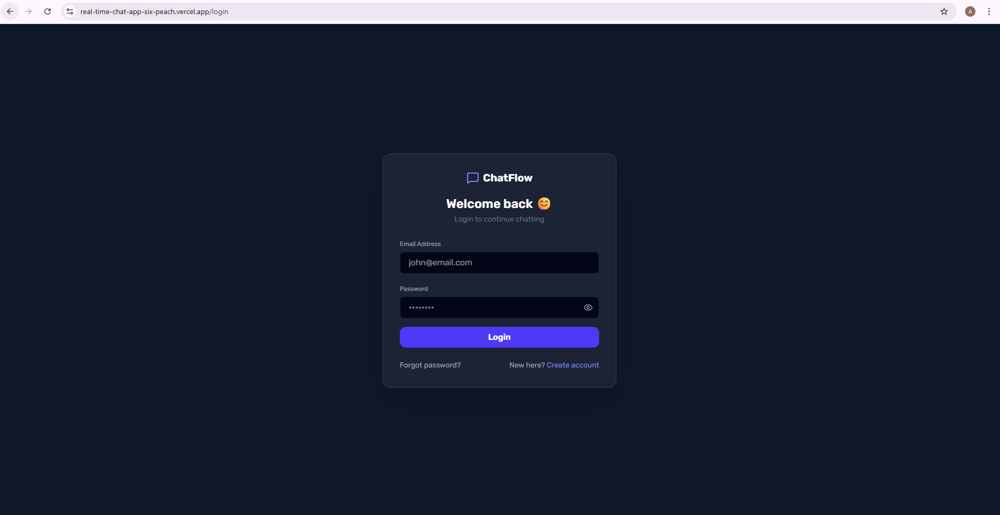
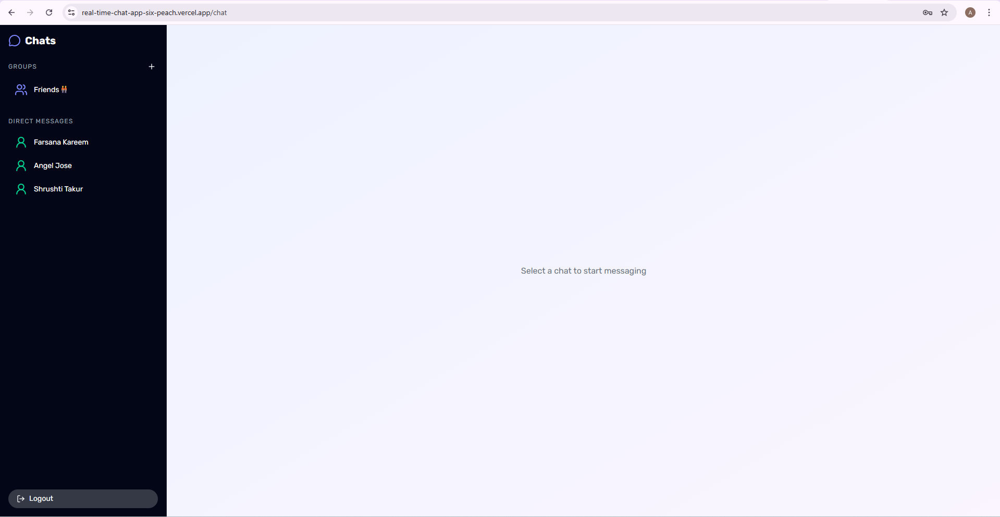
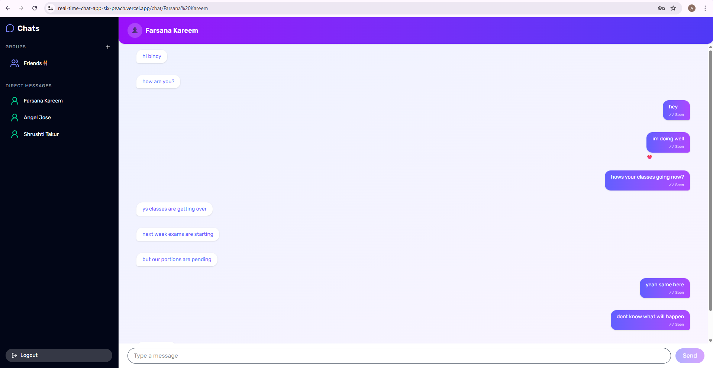
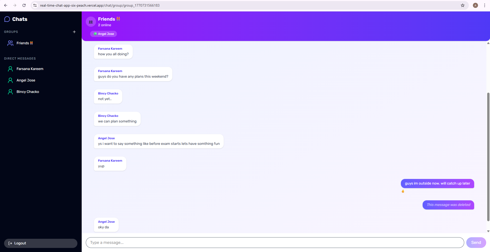
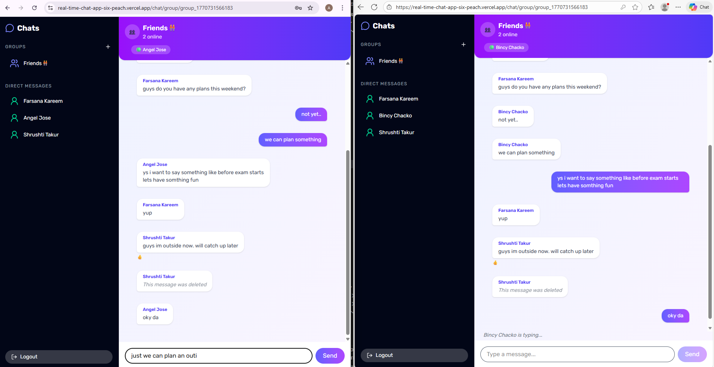
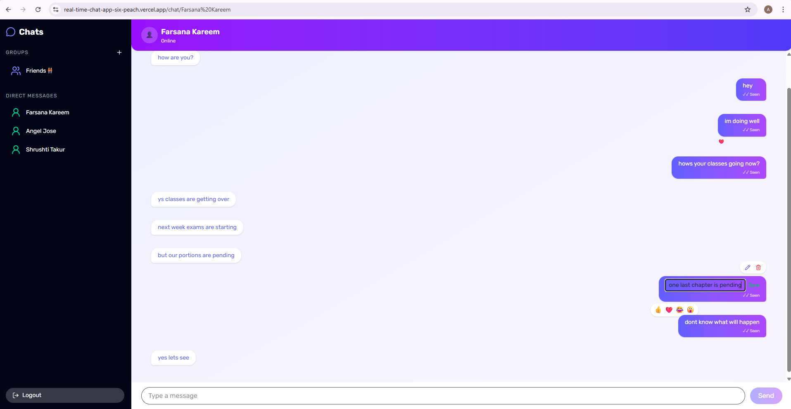

# 💬 Real-Time Chat Application

## 🌐 Live Demo

🔗 Frontend (Vercel):  
https://real-time-chat-app-six-peach.vercel.app

🔗 Backend API (Render):  
https://real-time-chat-app-j2w5.onrender.com

## 📌 Overview

A full-stack real-time chat platform built with modern web technologies, supporting private messaging, group chats, typing indicators, reactions, and online presence tracking.

---

## 🚀 Live Features

* 🔐 JWT Authentication (Cookie-based)
* 💬 Private 1-to-1 Chat
* 👥 Group Chat Rooms
* 🟢 Online / Offline Status
* ⌨️ Typing Indicators
* ✏️ Edit Messages
* 🗑️ Delete Messages
* 😀 Emoji Reactions
* 🤖 Chatbot Commands
* 🔁 Message Delivery Status
* 📱 Responsive UI

---

## 🛠️ Tech Stack

### Frontend

* Next.js 14 (App Router)
* TypeScript
* Tailwind CSS
* Socket.IO Client
* Axios

### Backend

* Node.js
* Express.js
* TypeScript
* Socket.IO
* MongoDB + Mongoose
* JWT Authentication
* Nodemailer (Mailtrap)

---

## 📂 Project Structure

```
real-time-chat-app/
│
├── client/          # Next.js Frontend
│   ├── src/
│   ├── components/
│   └── app/
│
├── server/          # Express Backend
│   ├── routes/
│   ├── models/
│   ├── socket/
│   └── config/
│
└── README.md
```

---

## ⚙️ Environment Variables

### Server (.env)

```
PORT=5000
MONGO_URI=your_mongodb_connection
JWT_SECRET=your_secret_key

MAILTRAP_SMTP_HOST=
MAILTRAP_SMTP_PORT=
MAILTRAP_SMTP_USER=
MAILTRAP_SMTP_PASS=
```

### Client (.env.local)

```
NEXT_PUBLIC_API_URL=http://localhost:5000
```

---

## 🧪 Run Locally

### 1️⃣ Clone repo

```
git clone https://github.com/your-username/real-time-chat-app.git
cd real-time-chat-app
```

---

### 2️⃣ Setup Backend

```
cd server
npm install
npm run dev
```

Runs on:

```
http://localhost:5000
```

---

### 3️⃣ Setup Frontend

```
cd client
npm install
npm run dev
```

Runs on:

```
http://localhost:3000
```

---

## 🔌 Socket Events

| Event          | Description             |
| -------------- | ----------------------- |
| joinRoom       | Join private/group room |
| sendMessage    | Send message            |
| receiveMessage | Receive message         |
| typing         | Typing indicator        |
| stopTyping     | Stop typing             |
| editMessage    | Edit message            |
| deleteMessage  | Delete message          |
| reactMessage   | Emoji reactions         |

---

## 🤖 Chatbot Commands

```
/bot hello
/bot how are you
/bot help
/bot bye
```

---

## 📸 Screenshots

### 🔐 Signup


### 🔑 Login


### 📃 Chatlist


### 💬 Private Chat


### 👥 Group Chat


### ... Typing Indicator


### 😀 Reactions & Edit/Delete



---

## 🌍 Deployment

* Frontend → Vercel
* Backend → Render
* Database → MongoDB Atlas

---

## 🔐 Security Features

* HTTP-only cookies
* JWT authentication
* Protected routes
* Auth middleware
* Token expiry handling
